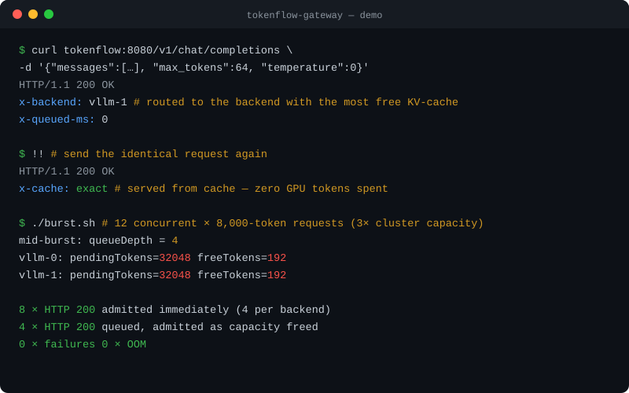
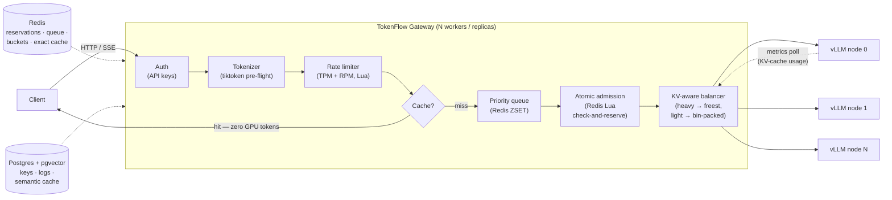

# TokenFlow Gateway

**A token-aware gateway and load balancer for self-hosted LLMs.** TokenFlow sits in
front of vLLM / Hugging Face TGI (or anything OpenAI-compatible), weighs every request
in tokens *before* it reaches a GPU, and routes, queues, caches, and rate-limits by the
one resource that actually takes inference servers down: **KV-cache capacity**.



## The bottleneck

Nginx and HAProxy count *connections*. A GPU running vLLM doesn't run out of
connections — it runs out of KV-cache. To a classic proxy, a 10-token prompt and a
10,000-token prompt are the same "request", so a burst of long-context traffic sails
straight through round-robin load balancing and lands as an OOM, a latency cliff, or a
crashed inference engine — while the proxy reports everything green.

TokenFlow closes that gap with four moves:

1. **Weigh before dispatch** — every request is tokenized at the edge
   (`weight = prompt tokens + max_tokens`), i.e. the KV-cache the backend must reserve.
2. **Admit atomically** — a request is only forwarded once an atomic Redis Lua
   check-and-reserve secures that weight against the target backend's live capacity.
   This holds across every worker and replica: no thundering herd, no over-admission.
3. **Queue instead of crash** — when nothing fits, requests wait in a Redis priority
   queue (per-key priority, FIFO within a class, configurable timeout) and drain in
   waves as capacity frees.
4. **Never compute twice** — deterministic requests are served from an exact
   (Redis) or semantic (pgvector) cache without touching a GPU.

## Architecture & request lifecycle



## Bare-metal benchmarks

Measured 2026-08-10 on a dedicated **AMD EPYC 9254 bare-metal server** (24 cores /
48 threads, 188 GB RAM, Ubuntu 24.04, tuned sysctls), gateway running **natively under
PM2 in cluster mode (48 workers)**; Redis, Postgres, mock vLLM backends, and the
8-thread load generator shared the host over loopback. The mock backends are the point:
these numbers isolate the **gateway's own overhead**, not GPU inference. Full
methodology, environment disclosure, single-process and Apple M1 baselines, and raw
autocannon output: [benchmarks/RESULTS.md](benchmarks/RESULTS.md). Reproduce with
`./scripts/bench.sh`.

| Scenario | Result (PM2 ×48, v1.0) |
|---|---|
| **Cache-hit path**, 1,000 conns | **30,618 req/s** avg (32,942 peak) · p50 30 ms · p99 40 ms |
| **Full proxy path**, 500 conns | **18,598 req/s** avg (19,142 peak) · p50 25 ms · p99 38 ms |
| **Full proxy path**, 100 conns | **12,432 req/s** avg · p50 7 ms · p99 12 ms |
| **Overload burst** — 200 heavy reqs ≈ 6× capacity | **200/200 · 0 failures · 168 queued · peak exactly 16/backend (the cap)** |

**Zero errors, timeouts, or non-2xx in every scenario** — over 2.5M requests measured
across all runs and configurations.

The overload row is the one that matters. 48 workers each admitting concurrently
produced *exactly* the same admission schedule as a single process: the Redis Lua
check-and-reserve guarantees cross-worker atomicity, so ~402k tokens of simultaneous
KV demand became 16 in-flight heavy requests per backend and an orderly priority queue —
not a collapsed GPU. (v0.x had per-process reservations; we benchmarked the resulting
thundering herd, fixed it, and kept both measurements in
[benchmarks/RESULTS.md](benchmarks/RESULTS.md).) The reservation costs 2–3 Redis round
trips per proxied request — free at saturation, ~2 ms p50 at low concurrency.

## Core features

- **Pre-flight token estimation** — js-tiktoken (cl100k) at the edge; a request's
  weight is prompt tokens plus its `max_tokens` output budget, the KV the GPU must
  actually reserve. Fast, deterministic, model-agnostic.
- **Token-aware routing** — backends are polled for vLLM Prometheus telemetry
  (`vllm:gpu_cache_usage_perc`, running/waiting). Heavy prompts go to the freest
  KV-cache; light prompts bin-pack onto busier nodes, preserving headroom for the next
  heavy request. Falls back to health checks + reservation accounting for backends
  without vLLM metrics.
- **Distributed atomic admission** — per-backend pending-token ledgers in Redis,
  updated by atomic Lua check-and-reserve/release. Safe across PM2 cluster workers and
  horizontal replicas; reservation TTLs make worker crashes fail conservative (extra
  queueing), never unsafe.
- **Redis priority queueing** — overload becomes an ordered wait, not a failure:
  sorted-set queue keyed by (API-key priority, arrival), drained the moment a
  reservation fits, 503 only after a configurable timeout.
- **Semantic + exact caching** — deterministic (`temperature ≤ 0`) responses cached by
  SHA-256 in Redis and by pgvector cosine similarity via any OpenAI-compatible
  embeddings endpoint. Hits cost zero GPU tokens and replay as SSE for streaming
  clients.
- **Token-based rate limiting** — per-key **TPM and RPM** token buckets in atomic Lua,
  charged on the estimate, reconciled to actual usage after completion — OpenAI-style
  limits for your own hardware.
- **Native SSE streaming** — upstream streams pipe through unbuffered while usage is
  parsed in-flight for metering.
- **Keys, metering, ops** — API keys hashed at rest in Postgres with limits and
  priorities; per-request logs (tokens, latency, queue time, cache, backend); live
  `/admin/status` with queue depth and per-backend reservations.

## Deployment guide

### Quick start — Docker Compose with mock backends (no GPU needed)

```bash
git clone https://github.com/mosafariuk/TokenFlow-Gateway.git && cd TokenFlow-Gateway
docker compose up --build
```

This launches the gateway (`127.0.0.1:8080`), Redis, Postgres (pgvector), and **two
mock vLLM backends** that emulate the OpenAI API, vLLM metrics, and deterministic
embeddings — the entire system, testable on a laptop:

```bash
# create an API key (plaintext returned exactly once)
curl -X POST localhost:8080/admin/keys \
  -H "Authorization: Bearer dev-admin-token" \
  -H "Content-Type: application/json" \
  -d '{"name":"demo","tpm_limit":100000,"rpm_limit":300,"priority":1}'

# OpenAI-compatible chat completion (streaming)
curl localhost:8080/v1/chat/completions \
  -H "Authorization: Bearer tfg-..." \
  -H "Content-Type: application/json" \
  -d '{"model":"mock-llm","messages":[{"role":"user","content":"hello"}],"stream":true}'
```

End-to-end check: `./scripts/smoke.sh` · benchmarks: `./scripts/bench.sh`

### Production — native PM2 cluster + standalone Redis/Postgres

```bash
npm install && npm run build
cp ecosystem.config.example.cjs ecosystem.config.cjs   # edit: backends, secrets, URLs
pm2 start ecosystem.config.cjs                          # cluster mode, one worker/thread
pm2 save && pm2 startup                                 # survive reboots
```

### Pointing at a real vLLM

`docker-compose.live.yml` swaps the mocks for a vLLM server running on the Docker host:

```bash
# capacity comes straight from vLLM's startup log: "GPU KV cache size: N tokens"
VLLM_CAPACITY_TOKENS=94048 \
docker compose -f docker-compose.yml -f docker-compose.live.yml up -d --no-deps redis postgres gateway
MODEL=microsoft/Phi-3-mini-4k-instruct ./scripts/smoke.sh
```

Validated against vLLM 0.27.1 + Phi-3-mini on an RTX A6000 — see
[benchmarks/LIVE-GPU-VALIDATION.md](benchmarks/LIVE-GPU-VALIDATION.md) for the full run,
including an overload burst queued against the engine's real KV capacity.

Production notes:

- **`capacityTokens` is your most important knob.** Set it from the real deployment:
  roughly `num_gpu_blocks × block_size` as reported by vLLM at startup.
- Cluster/multi-replica mode is safe: admission, queueing, and rate limits all
  coordinate through Redis. Point every worker/replica at the same Redis.
- Terminate TLS in front; set a long random `ADMIN_TOKEN`; keep Redis/Postgres
  on a private network.
- For semantic caching, point `EMBEDDING_URL` at a real embedding model (vLLM can
  serve one) and tune `SEMANTIC_DISTANCE_THRESHOLD` on your traffic.
- Host tuning for high concurrency: raise `ulimit -n`, `net.core.somaxconn`,
  `net.ipv4.tcp_max_syn_backlog`; widen `net.ipv4.ip_local_port_range`
  (see `benchmarks/RESULTS.md` for the exact values used in benchmarking).

## Environment variables

| Variable | Default | Meaning |
|---|---|---|
| `PORT` / `HOST` | `8080` / `0.0.0.0` | Listen address |
| `LOG_LEVEL` | `info` | Fastify/pino log level |
| `ADMIN_TOKEN` | — | Bearer token for `/admin/*` (set a long random secret) |
| `REDIS_URL` | `redis://localhost:6379` | Reservations, queue, buckets, exact cache |
| `DATABASE_URL` | `postgres://…:5432/tokenflow` | Keys, request logs, semantic cache |
| `BACKENDS` | — | JSON array `[{"name","url","capacityTokens"}]` — `capacityTokens` ≈ backend KV-cache size in tokens |
| `BACKEND_POLL_INTERVAL_MS` | `1000` | Metrics/health poll cadence |
| `BACKEND_POLL_RETRIES` / `BACKEND_POLL_BACKOFF_MS` / `BACKEND_POLL_JITTER_MS` | `2` / `100` / `100` | Retries per poll with exponential backoff + random jitter, so a transient timeout never drops a backend |
| `BACKEND_POLL_TIMEOUT_MS` | `2000` | Per-request timeout for `/metrics` and `/health` |
| `BACKEND_FAILURE_THRESHOLD` | `3` | Consecutive fully-failed polls before a backend leaves the routing pool |
| `HEAVY_PROMPT_THRESHOLD` | `2048` | Weight at which a request routes to the *freest* backend instead of bin-packing |
| `DEFAULT_MAX_TOKENS` | `1024` | Output budget assumed when `max_tokens` is absent |
| `QUEUE_TIMEOUT_MS` | `30000` | Max queue wait before `503` |
| `RESERVATION_TTL_SECONDS` | `120` | Crash backstop: orphaned reservations expire instead of pinning capacity |
| `CACHE_ENABLED` | `true` | Master switch for response caching |
| `CACHE_MAX_TEMPERATURE` | `0` | Only requests with `temperature ≤` this are cached |
| `CACHE_TTL_SECONDS` | `3600` | Exact-cache entry lifetime |
| `SEMANTIC_CACHE_ENABLED` | `false` | pgvector similarity cache (requires `EMBEDDING_URL`) |
| `EMBEDDING_URL` / `EMBEDDING_MODEL` | — / `mock-embed` | OpenAI-compatible `/v1/embeddings` endpoint |
| `EMBEDDING_DIM` | `384` | Embedding dimensionality (must match the model) |
| `SEMANTIC_DISTANCE_THRESHOLD` | `0.05` | Max cosine distance counted as a semantic hit |

## API reference

OpenAI-compatible on both sides — existing SDKs work by changing only `base_url` and
the API key.

**Inference** (`Authorization: Bearer <api key>`):

```bash
# chat completions (stream or not)
curl localhost:8080/v1/chat/completions -H "Authorization: Bearer tfg-..." \
  -H "Content-Type: application/json" \
  -d '{"model":"my-model","messages":[{"role":"user","content":"…"}],"max_tokens":256}'

# text completions
curl localhost:8080/v1/completions -H "Authorization: Bearer tfg-..." \
  -H "Content-Type: application/json" \
  -d '{"model":"my-model","prompt":"Once upon a time","max_tokens":64}'
```

Response headers: `x-backend`, `x-cache` (`exact`/`semantic`), `x-queued-ms`,
`x-ratelimit-remaining-requests`, `x-ratelimit-remaining-tokens`.

**Admin** (`Authorization: Bearer $ADMIN_TOKEN`):

```bash
curl -X POST localhost:8080/admin/keys -H "Authorization: Bearer $ADMIN_TOKEN" \
  -H "Content-Type: application/json" \
  -d '{"name":"team-a","tpm_limit":200000,"rpm_limit":600,"priority":1}'

curl localhost:8080/admin/usage  -H "Authorization: Bearer $ADMIN_TOKEN"   # 24h per-key usage
curl localhost:8080/admin/status -H "Authorization: Bearer $ADMIN_TOKEN"   # live backends + queue
```

| Route | Description |
|---|---|
| `POST /v1/chat/completions` · `POST /v1/completions` | OpenAI-compatible inference proxy (SSE + JSON) |
| `GET /v1/models` | Passthrough to a healthy backend |
| `GET /healthz` | Gateway + backend health (no auth) |
| `POST/GET /admin/keys` · `PATCH/DELETE /admin/keys/:id` | Key lifecycle (create/list/update/revoke) |
| `GET /admin/usage` | Per-key 24 h tokens, latency, cache hits |
| `GET /admin/status` | Queue depth, per-backend KV usage + reservations |

## License

MIT — see [LICENSE](LICENSE).
